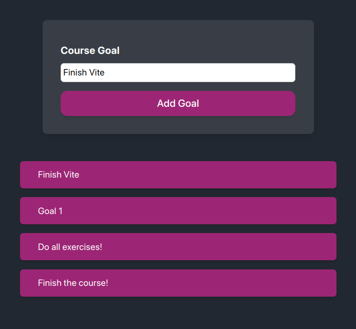

# Styling React Components with Vite

This is a simple React project created with Vite to practice styling with various methods including styled-components and tailwind-styles-components.
Getting Started

To get started with this project, you can clone the repository and install the dependencies:



```bash
git clone <https://github.com/[username>]/[project-name].git
cd [project-name]
npm install
```

## Available Scripts

In the project directory, you can run:

`npm run dev`

Runs the app in development mode.<br />
Open <http://localhost:3000> to view it in the browser.

The page will reload if you make edits.<br />
You will also see any lint errors in the console.

`npm run build`

Builds the app for production to the dist folder.<br />
It correctly bundles React in production mode and optimizes the build for the best performance.

`npm run serve`

Serves the production build from the dist folder.<br />
Open <http://localhost:5000> to view it in the browser.
Available Styles

This project uses the following styling methods:

- styled-components: <https://styled-components.com/>
- tailwind-styles-components: <https://tailwindcss.com/docs/guides/create-react-app>

## Contributing

Contributions are always welcome! If you have any suggestions or find any bugs, please feel free to create an issue or submit a pull request.
License

This project is licensed under the MIT License - see the LICENSE file for details.
